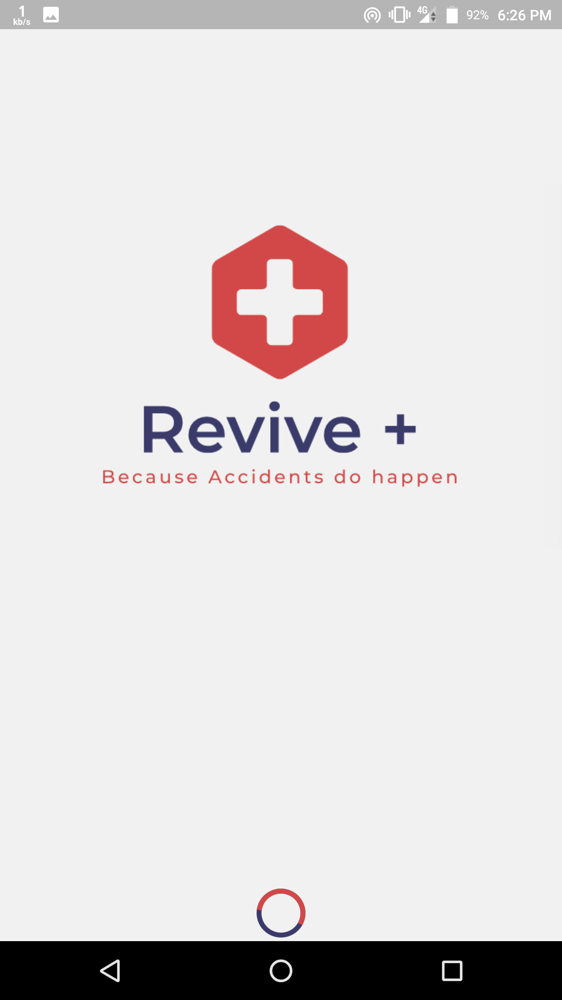
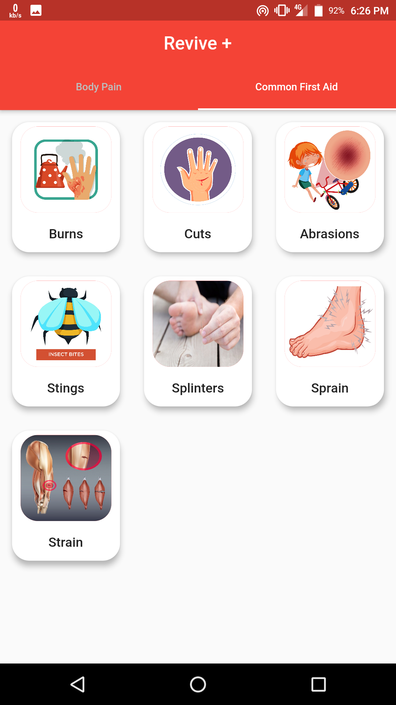

<h1 align="center">Revive+</h1>

  <b>
Because accidents do happen</b> 
  A complete reference book of all medical aid and for all mishaps and crises that may happen surprisingly. 
Created to build the consciousness of individuals in non-particular clinical viewpoints so as to expand mindfulness and create crisis limit if there should arise an occurrence of any crises or unexpected mishaps.

 
 
      
 
 
 

  

      

  

